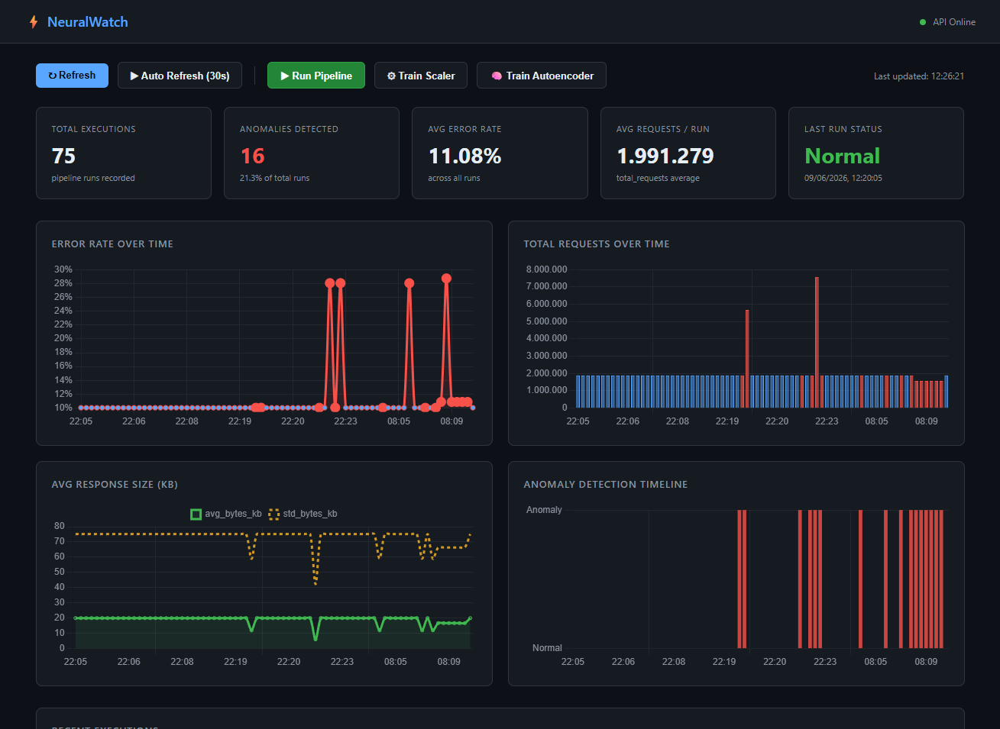

# NeuralWatch — ETL Health Monitor (V2)



## Overview

NeuralWatch is an ETL (Extract, Transform, Load) Health Monitor system that uses Machine Learning to detect anomalies in operational metrics. Developed in Python with FastAPI for the API and SQLite for data persistence, NeuralWatch now incorporates two anomaly detection approaches: **Isolation Forest** (V1) and a **Deep Learning-based Autoencoder** (V2), offering flexibility and robustness in identifying unusual behaviors.

## Features

### Version 1 (V1) - Isolation Forest

- **Metrics Collection**: Extracts metrics from simulated logs (total requests, error rate, average response size, etc.).
- **Anomaly Detection**: Uses the Isolation Forest algorithm to identify deviations from the standard pipeline behavior.
- **Persistence**: Stores metrics and anomaly detection results in an SQLite database (`neuralwatch.db`).
- **REST API**: Provides endpoints to execute the pipeline, train the model, and query metrics.
- **Web Dashboard**: Simple graphical interface to visualize real-time metrics, charts, and execution history.

### Version 2 (V2) - Autoencoder with StandardScaler

- **Robust Preprocessing**: Implementation of `StandardScaler` to normalize metrics, ensuring all features contribute equally to anomaly detection, regardless of their scales.
- **Anomaly Detection with Deep Learning**: Introduction of an Autoencoder (Keras/TensorFlow) to learn normal behavior patterns and identify anomalies based on reconstruction error.
- **Dynamic Threshold**: Calculation and persistence of an anomaly threshold based on the percentile of reconstruction errors from training data, stored in `threshold.json`.
- **Model Switching**: Ability to switch between Isolation Forest and Autoencoder for anomaly detection via an environment variable (`MODEL_TYPE`).
- **Dedicated Endpoints**: New API endpoints to train the Scaler and Autoencoder, in addition to a unified prediction endpoint

### Version 3 (V3) - In Developing process

## Setup

Follow the steps below to set up and run NeuralWatch in your local environment.

### Prerequisites

- Python 3.8+
- pip (Python package manager)
- git (to clone the repository)

### 1. Clone the Repository

```Bash
git clone https://github.com/wilcsonaraujo/NeuralWatch_ETL_Health_Monitor.git
cd NeuralWatch_ETL_Health_Monitor
```
### 2. Creating and Activating the Virtual Environment

It is highly recommended to use a virtual environment to manage project dependencies.

```Bash
python3 -m venv .venv
.venv\Scripts\activate  # Windows
# source .venv/bin/activate   # Linux/macOS
```
### 3. Install the Dependencies

Install all necessary libraries, including TensorFlow and Keras.

```Bash
pip install -r requirements.txt
```
### 4. Configure Environment Variables

Create a `.env` file in the project root to define which anomaly detection model will be used.

```Bash
touch .env
```

Edit the `.env` file and add one of the following lines:

- To use Isolation Forest (V1 ):

```Text
MODEL_TYPE=ISOLATION_FOREST
```

- To use Autoencoder (V2):

```Text
MODEL_TYPE=AUTOENCODER
```

## Usage

### 1. Start the FastAPI Server

Open a terminal in the project root and start the FastAPI server. Make sure your virtual environment is activated.

```Bash
uvicorn src.api.main:app --reload
```
The server will be available at `http://127.0.0.1:8000`

### 2. Access the Web Dashboard

Open the `src/dashboard/index.html` file in your web browser. It will automatically connect to the API and start displaying data.

### 3. Train the Models

For anomaly detection to work, the models need to be trained. You can do this in two ways:

#### Via Dashboard

On the dashboard, use the buttons:

- **Train Scaler**: Trains the StandardScaler and Isolation Forest (V1 ).
- **Train Autoencoder**: Trains the Autoencoder (V2) and calculates the threshold.

#### Via API (cURL)

- Train Scaler and Isolation Forest:

```Bash
curl -X POST http://127.0.0.1:8000/train-scaler-model
```

- Train Autoencoder:

```Bash
curl -X POST http://127.0.0.1:8000/train-autoencoder
```

### 4. Run the ETL Pipeline

The pipeline simulates data collection and anomaly detection. You can run it via the dashboard or terminal.

#### Via Dashboard

Click the **Run Pipeline** button.

#### Via Terminal

Open another terminal (keeping the FastAPI server running ) in the project root and execute:

```Bash
python3 -m src.etl.pipeline
```
**Tip**: Run the pipeline multiple times to populate the database and generate data for training and anomaly detection.

### 5. Switch Detection Models

To change which model NeuralWatch uses for anomaly detection, edit the `.env` file in your project root:

- **To use Isolation Forest** (V1):

```Text
MODEL_TYPE=ISOLATION_FOREST
```

- **To use Autoencoder** (V2):

```Text
MODEL_TYPE=AUTOENCODER
```

**Important**: After changing the `.env` file, you will need to restart the **FastAPI** server for the change to take effect.

## Validation and Testing

To validate the model's operation:

1. Populate the Database with Normal Data: Disable chaos in `src/etl/chaos.py` (set `probability=0`) and run the pipeline a few times.
2. Train Both Models: Train both Isolation Forest and Autoencoder using the dashboard buttons or API endpoints.
3. Inject Anomalies: Enable chaos in `src/etl/chaos.py` (set `probability` to a value like `0.2` or `0.3`).
4. Compare Models:
    - Set `MODEL_TYPE=ISOLATION_FOREST` in `.env` and restart the server. Run the pipeline a few times and observe detections on the dashboard.
    - Set `MODEL_TYPE=AUTOENCODER` in `.env` and restart the server. Run the pipeline again and compare the results.

Observe which model detects injected anomalies more effectively and with fewer false positives.

Developed by Wilcson Araújo with many coffes.
